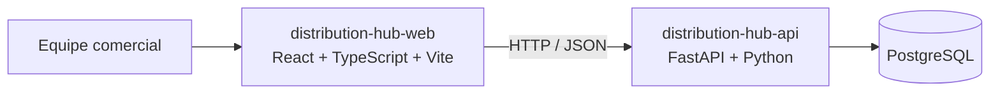

# Arquitetura

## Visão

O sistema terá uma aplicação web e uma API em exatamente dois repositórios. A API é um **monólito modular**: uma aplicação FastAPI organizada por módulos, sem microserviços.



## Repositórios e stack

| Camada | Tecnologia | Estado |
|---|---|---|
| Web | React, TypeScript e Vite | Scaffold; sem fluxos comerciais |
| API | Python e FastAPI | `GET /health` implementado |
| Dados | PostgreSQL | Docker Compose local |
| Persistência | SQLAlchemy e Alembic | Configurados; tabela inicial `users` criada |
| Integração | HTTP/JSON e OpenAPI gerado | Contrato atual contém essencialmente health |

A documentação comum fica no repositório da API. A separação de repositórios não implica microserviços nem deploy independente já configurado.

## Persistência atual

A aplicação possui uma fundação inicial de persistência:

```text
.env
  ↓
app/core/config.py
  ↓
app/db/session.py
  ↓
SQLAlchemy Engine
  ↓
PostgreSQL
```

O modelo atual é:

```text
User
  ↓
users
```

A estrutura da tabela `users` é controlada pelo Alembic através da migration inicial.

A tabela `users` possui:

- `id` como chave primária;
- `email` como campo obrigatório e único;
- `created_at` como data de criação gerada pelo PostgreSQL.

Ainda não foram implementadas as tabelas de empresas, associações entre usuários e empresas ou clientes.

## Decisões vigentes

- Manter a API como monólito modular.
- Usar React/TypeScript/Vite no frontend e FastAPI/Python na API.
- Manter exatamente dois repositórios:
  - `distribution-hub-web`;
  - `distribution-hub-api`.
- Usar PostgreSQL como banco de dados.
- Usar Docker Compose para executar o PostgreSQL localmente.
- Usar SQLAlchemy para o mapeamento entre Python e banco de dados.
- Usar Alembic para versionar alterações na estrutura do banco.
- Manter as configurações da aplicação no `.env`, carregadas por `pydantic-settings`.
- Adotar OAuth 2.0 somente no nível de framework/protocolo; o desenho de identidade permanece pendente.

## Isolamento e operação

O papel pertence ao vínculo entre usuário e empresa. O backend deve validar identidade, associação, empresa ativa e permissão em cada operação protegida.

CI valida a API e o frontend separadamente. Ainda não há integração entre as aplicações, ambiente de produção, SLA, alta disponibilidade ou observabilidade avançada.
