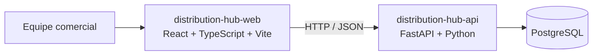

# Arquitetura

## Visão

O sistema terá uma aplicação web e uma API em exatamente dois repositórios. A API é um **monólito modular**: uma aplicação FastAPI organizada por módulos, sem microserviços.

## Repositórios e stack

| Camada | Tecnologia | Estado |
|---|---|---|
| Web | React, TypeScript e Vite | Scaffold; sem fluxos comerciais |
| API | Python e FastAPI | `GET /health` implementado |
| Dados | PostgreSQL | Docker Compose local |
| Persistência | SQLAlchemy e Alembic | Dependências presentes; sem schema comercial |
| Integração | HTTP/JSON e OpenAPI gerado | Contrato atual contém essencialmente health |

A documentação comum fica no repositório da API. A separação de repositórios não implica microserviços nem deploy independente já configurado.

## Decisões vigentes

- Manter API como monólito modular.
- Usar React/TypeScript/Vite no frontend e FastAPI/Python na API.
- Manter exatamente dois repositórios: `distribution-hub-web` e `distribution-hub-api`.
- Adotar OAuth 2.0 somente no nível de framework/protocolo; o desenho de identidade permanece pendente.

## Isolamento e operação

O papel pertence ao vínculo usuário–empresa. O backend deve validar identidade, associação, empresa ativa e permissão em cada operação protegida. CI valida API e frontend separadamente; não há ainda integração entre aplicações, produção, SLA, alta disponibilidade ou observabilidade avançada.