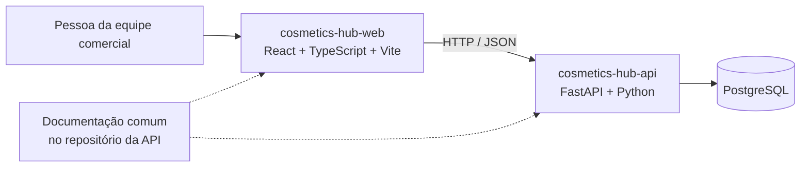

# Arquitetura do Cosmetics Hub

## Visão geral

O sistema é composto por uma aplicação web e uma API mantidas em repositórios separados. A API é documentada como um monólito modular: uma aplicação FastAPI única, organizada por módulos de domínio, sem separar cada módulo em microserviços.

Uma visualização separada, com a fronteira entre os dois repositórios, está no [diagrama de contexto](diagrams/system-context.mmd). Repositórios são unidades de organização do código; não significam, por si só, serviços implantados ou microserviços.

## Repositórios e responsabilidade

| Repositório | Responsabilidade |
|---|---|
| [cosmetics-hub-web](https://github.com/lc-curto/cosmetics-hub-web) | Interface web React/TypeScript/Vite. |
| [cosmetics-hub-api](https://github.com/lc-curto/cosmetics-hub-api) | API FastAPI/Python, documentação comum, configuração do PostgreSQL local e espaço para módulos da API. |

Não há um terceiro repositório de documentação. O contrato HTTP é a fronteira de integração; FastAPI gera OpenAPI para os endpoints que estiverem implementados.

## Tecnologias registradas

| Camada | Tecnologia | Situação verificada |
|---|---|---|
| Web | React, TypeScript, Vite | Scaffold presente; não há fluxos comerciais implementados. |
| API | FastAPI, Python | Aplicação presente com `GET /health`; rotas de produto ainda ausentes. |
| Dados | PostgreSQL | Serviço local configurado em Docker Compose; não há schema de negócio. |
| Persistência | SQLAlchemy, Alembic | Dependências e diretório de migrations existem; modelos e migrations de negócio não existem. |
| Autenticação | OAuth 2.0 | Escolha de alto nível registrada; fluxo, provedor e detalhes de identidade ainda não especificados. |

## Isolamento por empresa

O produto é especificado para várias empresas. O papel de uma pessoa pertence à sua associação com cada empresa. As regras exigem que operações e consultas se limitem à empresa ativa, mas o mecanismo de autenticação, autorização e transmissão desse contexto ainda não está implementado nem completamente definido.

## Contrato entre aplicações

As aplicações devem integrar-se por HTTP/JSON usando um contrato documentado. A API FastAPI expõe `/openapi.json` gerado a partir das rotas existentes; no estado atual, isso descreve essencialmente o endpoint de saúde. A publicação e o versionamento de um contrato para as futuras operações comerciais ainda precisam ser incorporados ao processo de desenvolvimento.

## Qualidade e operação presentes

Cada repositório possui seu próprio workflow de GitHub Actions: testes da API e build do frontend. O serviço PostgreSQL local é inicializado pelo Docker Compose. Não há configuração documentada de produção, deploy, SLA, observabilidade avançada ou alta disponibilidade.

## Registros de decisão

As escolhas aceitas e suas consequências estão em [ADRs](decisions/). A arquitetura em vigor é: monólito modular na API, React separado da API em exatamente dois repositórios e OAuth 2.0 escolhido somente no nível de framework/protocolo. Detalhes em aberto permanecem listados como questões, não como decisões implícitas.
