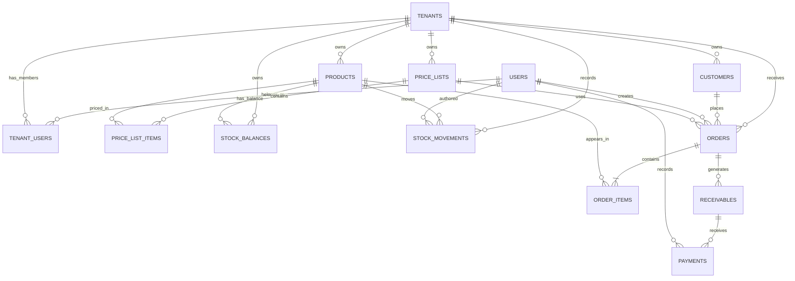

# Análise ER — Distribution Hub MVP

> Este documento apresenta uma proposta completa de modelo Entidade–Relacionamento para o MVP. Ele é uma análise de domínio, não uma implementação. Nenhuma tabela, migration ou modelo Python deve ser criado antes da revisão deste documento.

## 1. Objetivo do modelo

O Distribution Hub será uma plataforma de gestão comercial para empresas que trabalham com clientes, catálogo de produtos, preços, estoque, pedidos e recebimentos.

O modelo precisa garantir principalmente:

- isolamento dos dados entre empresas;
- associação de utilizadores a várias empresas;
- papéis diferentes para a mesma pessoa em empresas diferentes;
- histórico comercial sem apagar dados relevantes;
- validação de clientes, produtos, preços e estoque nos pedidos;
- rastreabilidade das operações importantes.

## 2. Decisão central: empresa como fronteira dos dados

A entidade `tenants` representa a empresa que utiliza a plataforma.

Quase todos os dados comerciais pertencem a uma empresa. Portanto, a maior parte das entidades deve possuir uma chave estrangeira `tenant_id`.

```text
users              identidade global da pessoa
 tenants           empresa que separa os dados
 tenant_users      vínculo da pessoa com a empresa e o seu papel
 customers         clientes comerciais da empresa
 products          catálogo de produtos da empresa
 price_lists       listas de preços da empresa
 stock_balances    saldo atual de produto por empresa
 stock_movements   histórico de entradas e saídas
 orders            pedidos realizados para clientes
 order_items       produtos incluídos nos pedidos
 receivables       valores a receber originados dos pedidos
 payments          pagamentos recebidos para quitar recebíveis
```

## 3. Diagrama geral



Legenda:

- `||` significa exatamente um;
- `o|` significa zero ou um;
- `o{` significa zero ou muitos;
- `|{` significa um ou muitos.

## 4. Entidades e atributos

Os tipos abaixo são conceptuais. Os tipos concretos de SQLAlchemy/PostgreSQL serão definidos durante a implementação.

---

## 4.1 `users`

Representa a identidade global de uma pessoa. Não representa a relação dessa pessoa com uma empresa específica.

| Campo | Obrigatório | Regra / finalidade |
|---|---:|---|
| `id` | Sim | Chave primária. Identificador interno da pessoa. |
| `email` | Sim | E-mail global da conta. Deve ser único. |
| `first_name` | Não | Nome próprio, quando informado. |
| `last_name` | Não | Apelido ou nome de família, quando informado. |
| `is_active` | Sim | Indica se a conta pode ser utilizada. Valor inicial: ativo. |
| `email_verified_at` | Não | Momento em que o e-mail foi confirmado. |
| `last_login_at` | Não | Momento do último login registado. |
| `created_at` | Sim | Data de criação. |
| `updated_at` | Sim | Data da última alteração. |

### Não colocar em `users`

- `tenant_id`, porque uma pessoa pode pertencer a várias empresas;
- `role`, porque o papel pode mudar de uma empresa para outra;
- permissões comerciais específicas;
- dados da empresa;
- password antes de decidir a estratégia de autenticação.

### Regras

- `email` deve ser único globalmente, sem distinguir maiúsculas de minúsculas;
- uma conta inativa não deve conseguir autenticar-se nem executar operações protegidas;
- `first_name` e `last_name` podem ser preenchidos posteriormente.
- a conta pode existir sem estar associada a uma empresa;
- o modelo atual com `id`, `email` e `created_at` é a primeira versão e deverá evoluir para esta proposta.

---

## 4.2 `tenants`

Representa uma empresa cliente da plataforma e a fronteira de isolamento dos dados comerciais.

| Campo | Obrigatório | Regra / finalidade |
|---|---:|---|
| `id` | Sim | Chave primária. |
| `name` | Sim | Nome comercial ou nome da empresa. |
| `legal_name` | Não | Razão social, se diferente do nome comercial. |
| `tax_id` | Não | Identificação fiscal, sujeita à regra do país. |
| `is_active` | Sim | Indica se a empresa pode operar. |
| `created_at` | Sim | Data de criação. |
| `updated_at` | Sim | Data da última alteração. |

### Regras

- uma empresa inativa não aceita novas operações;
- uma empresa deve manter pelo menos um `ADMIN` ativo;
- `tax_id` é opcional; quando preenchido, deve ter o formato validado e seguir uma regra de unicidade definida para o sistema;
- os dados comerciais devem ser filtrados por `tenant_id` em todas as consultas protegidas.

---

## 4.3 `tenant_users`

Representa a associação entre uma pessoa e uma empresa. É a entidade que resolve a relação muitos-para-muitos entre `users` e `tenants`.

| Campo | Obrigatório | Regra / finalidade |
|---|---:|---|
| `id` | Sim | Chave primária da associação. |
| `tenant_id` | Sim | FK para `tenants`. |
| `user_id` | Sim | FK para `users`. |
| `role` | Sim | Papel atual, inicialmente `ADMIN` ou `OPERATOR`. |
| `status` | Sim | Estado da associação, por exemplo `ACTIVE` ou `SUSPENDED`. |
| `joined_at` | Sim | Data de entrada na empresa. |
| `created_at` | Sim | Data de criação do vínculo. |
| `updated_at` | Sim | Data da última alteração. |

### Constraints

- `UNIQUE (tenant_id, user_id)` para impedir a mesma associação duplicada;
- `tenant_id` referencia `tenants`;
- `user_id` referencia `users`;
- `role` deve aceitar apenas valores definidos pelo domínio;
- `status` deve aceitar apenas estados definidos pelo domínio.

### Regras

- uma pessoa pode ter várias associações, uma por empresa;
- o mesmo utilizador pode ser `ADMIN` numa empresa e `OPERATOR` noutra;
- não é permitido remover ou rebaixar o último `ADMIN` ativo de uma empresa;
- o acesso exige conta ativa, associação ativa, empresa ativa e permissão suficiente.

---

## 4.4 `customers`

Representa a pessoa ou organização atendida comercialmente. Um cliente não é necessariamente um utilizador do sistema.

| Campo | Obrigatório | Regra / finalidade |
|---|---:|---|
| `id` | Sim | Chave primária. |
| `tenant_id` | Sim | Empresa proprietária do cliente. |
| `name` | Sim | Nome do cliente. |
| `customer_code` | Não | Código interno da empresa. |
| `email` | Não | E-mail de contacto. |
| `phone` | Não | Telefone de contacto. |
| `tax_id` | Não | Identificação fiscal do cliente. |
| `address` | Não | Morada ou referência para a primeira versão. |
| `is_active` | Sim | Cliente inativo não entra em novos pedidos. |
| `created_at` | Sim | Data de criação. |
| `updated_at` | Sim | Data da última alteração. |

### Regras

- cada cliente pertence a uma única empresa;
- clientes não devem ser apagados quando já possuem histórico comercial; devem ser inativados;
- clientes inativos podem continuar visíveis no histórico;
- um cliente inativo não pode ser utilizado num novo pedido;
- `customer_code`, quando usado, deve ser único dentro da empresa: `UNIQUE (tenant_id, customer_code)`.

---

## 4.5 `products`

Representa um item comercial que pode ser vendido ou movimentado em estoque.

| Campo | Obrigatório | Regra / finalidade |
|---|---:|---|
| `id` | Sim | Chave primária. |
| `tenant_id` | Sim | Empresa proprietária do produto. |
| `sku` | Sim | Código interno único do produto na empresa. |
| `name` | Sim | Nome comercial. |
| `description` | Não | Descrição do produto. |
| `unit` | Sim | Unidade de venda, por exemplo `UN`, `KG` ou `CX`. |
| `is_active` | Sim | Produto disponível para novas operações. |
| `created_at` | Sim | Data de criação. |
| `updated_at` | Sim | Data da última alteração. |

### Regras

- `sku` deve ser único dentro da empresa: `UNIQUE (tenant_id, sku)`;
- produto inativo não pode entrar em novos pedidos;
- produto inativo pode continuar presente em pedidos históricos;
- não apagar produto que possua movimentos ou pedidos históricos.

---

## 4.6 `price_lists`

Representa uma lista de preços pertencente a uma empresa.

| Campo | Obrigatório | Regra / finalidade |
|---|---:|---|
| `id` | Sim | Chave primária. |
| `tenant_id` | Sim | Empresa proprietária. |
| `name` | Sim | Nome da lista, por exemplo `Normal` ou `Atacado`. |
| `currency` | Sim | Moeda, por exemplo `EUR`. |
| `is_default` | Sim | Indica a lista padrão da empresa. |
| `is_active` | Sim | Indica se pode ser utilizada em novos pedidos. |
| `created_at` | Sim | Data de criação. |
| `updated_at` | Sim | Data da última alteração. |

### Regras

- uma lista pertence a uma empresa;
- uma empresa pode possuir várias listas;
- deve existir exatamente uma lista padrão ativa por empresa;
- ao criar uma empresa, o sistema deve criar ou exigir a sua lista padrão inicial;
- uma lista inativa não pode ser selecionada para novos pedidos;
- os preços usados no pedido devem ser preservados no `order_items`, mesmo que a lista mude depois.

---

## 4.7 `price_list_items`

Representa o preço de um produto dentro de uma lista específica.

| Campo | Obrigatório | Regra / finalidade |
|---|---:|---|
| `id` | Sim | Chave primária. |
| `price_list_id` | Sim | FK para `price_lists`. |
| `product_id` | Sim | FK para `products`. |
| `unit_price` | Sim | Preço unitário não negativo. |
| `created_at` | Sim | Data de criação. |
| `updated_at` | Sim | Data da última alteração. |

### Constraints e regras

- `UNIQUE (price_list_id, product_id)`;
- o preço deve ser maior ou igual a zero;
- a lista e o produto devem pertencer à mesma empresa;
- um produto sem preço válido não pode ser utilizado num pedido que dependa dessa lista.

---

## 4.8 `stock_balances`

Representa o saldo atual de um produto dentro de uma empresa. O MVP não terá armazéns; portanto, existe uma posição de stock por combinação de empresa e produto.

| Campo | Obrigatório | Regra / finalidade |
|---|---:|---|
| `id` | Sim | Chave primária. |
| `tenant_id` | Sim | FK para `tenants`. |
| `product_id` | Sim | FK para `products`. |
| `quantity` | Sim | Saldo atual, nunca negativo. |
| `updated_at` | Sim | Data da última atualização do saldo. |

### Constraints e regras

- `UNIQUE (tenant_id, product_id)`;
- empresa e produto devem pertencer ao mesmo contexto;
- stock negativo é proibido;
- a alteração deve ocorrer na mesma transação da criação do movimento de stock;
- uma saída superior à quantidade disponível deve ser bloqueada.

---

## 4.9 `stock_movements`

Representa cada entrada, saída ou ajuste de stock. É a fonte histórica para auditoria.

| Campo | Obrigatório | Regra / finalidade |
|---|---:|---|
| `id` | Sim | Chave primária. |
| `tenant_id` | Sim | Empresa da operação. |
| `product_id` | Sim | Produto movimentado. |
| `movement_type` | Sim | `IN`, `OUT` ou `ADJUSTMENT`, inicialmente. |
| `quantity` | Sim | Quantidade positiva do movimento. |
| `reference_type` | Não | Tipo do documento relacionado, por exemplo pedido. |
| `reference_id` | Não | Identificador do documento relacionado. |
| `notes` | Não | Justificação ou observação do ajuste. |
| `created_by` | Sim | FK para `users`, autor da operação. |
| `created_at` | Sim | Data e hora da operação. |

### Regras

- movimentos não devem ser apagados normalmente;
- correções devem gerar um novo movimento de ajuste;
- autor, empresa, data e contexto devem ser preservados;
- a atualização de `stock_balances` e a criação do movimento devem ser atómicas;
- uma saída só pode ser criada se o saldo disponível for suficiente;
- a confirmação de um pedido deve gerar os movimentos de stock uma única vez.

---

## 4.10 `orders`

Representa um pedido comercial feito por um cliente.

| Campo | Obrigatório | Regra / finalidade |
|---|---:|---|
| `id` | Sim | Chave primária. |
| `tenant_id` | Sim | Empresa do pedido. |
| `customer_id` | Sim | Cliente do pedido. |
| `price_list_id` | Não | Lista usada para calcular os preços. |
| `status` | Sim | Estado do pedido, por exemplo `DRAFT`, `CONFIRMED`, `CANCELLED`. |
| `order_number` | Sim | Número legível e único dentro da empresa. |
| `subtotal` | Sim | Soma dos itens antes de ajustes. |
| `discount_total` | Sim | Total de descontos. |
| `total` | Sim | Valor final do pedido. |
| `notes` | Não | Observações comerciais. |
| `created_by` | Sim | FK para `users`, autor da criação. |
| `confirmed_by` | Não | FK para `users`, autor da confirmação. |
| `confirmed_at` | Não | Momento da confirmação. |
| `cancelled_at` | Não | Momento do cancelamento. |
| `created_at` | Sim | Data de criação. |
| `updated_at` | Sim | Data da última alteração. |

### Regras de estado

- `DRAFT` pode ser editado;
- `CONFIRMED` é uma operação comercial consolidada;
- `CANCELLED` não pode voltar a ser usado como pedido ativo sem uma decisão explícita;
- a confirmação deve validar cliente ativo, produtos ativos, preços válidos e stock;
- a confirmação e os movimentos de stock devem ocorrer na mesma transação lógica;
- a confirmação deve gerar os movimentos de stock uma única vez;
- um pedido confirmado deve preservar os valores calculados no momento da confirmação;
- um pedido pode não gerar recebível apenas em condições explícitas, como oferta ou operação sem dívida a cobrar.

---

## 4.11 `order_items`

Representa cada produto dentro de um pedido. É necessário guardar um retrato do preço usado, porque o produto e a lista de preços podem mudar no futuro.

| Campo | Obrigatório | Regra / finalidade |
|---|---:|---|
| `id` | Sim | Chave primária. |
| `order_id` | Sim | FK para `orders`. |
| `product_id` | Sim | FK para `products`. |
| `quantity` | Sim | Quantidade pedida, maior que zero. |
| `unit_price` | Sim | Preço unitário aplicado no momento do pedido. |
| `discount` | Sim | Desconto do item, se existir. |
| `line_total` | Sim | Total calculado da linha. |
| `created_at` | Sim | Data de criação do item. |

### Regras

- um item pertence a exatamente um pedido;
- o pedido deve ter pelo menos um item para ser confirmado;
- um produto só pode aparecer uma vez em cada pedido;
- se o utilizador adicionar o mesmo produto novamente, a aplicação deve agregar a quantidade à linha existente;
- `product_id` mantém a referência do produto, mas `unit_price` e `line_total` preservam o histórico;
- quantidades e valores monetários não podem assumir valores inválidos.

---

## 4.12 `receivables`

Representa um valor que a empresa deve receber, normalmente originado de um pedido confirmado.

| Campo | Obrigatório | Regra / finalidade |
|---|---:|---|
| `id` | Sim | Chave primária. |
| `tenant_id` | Sim | Empresa proprietária do recebível. |
| `order_id` | Sim | Pedido que originou o recebível, se aplicável. |
| `customer_id` | Sim | Cliente responsável pelo pagamento. |
| `due_date` | Sim | Data de vencimento. |
| `original_amount` | Sim | Valor original a receber. |
| `paid_amount` | Sim | Valor já pago. |
| `status` | Sim | `OPEN`, `PARTIALLY_PAID`, `PAID`, `OVERDUE` ou equivalente. |
| `created_at` | Sim | Data de criação. |
| `updated_at` | Sim | Data da última alteração. |

### Regras

- o cliente e o pedido devem pertencer à mesma empresa;
- `paid_amount` não pode exceder `original_amount`, salvo decisão explícita sobre créditos;
- o estado pode ser derivado dos valores e das datas, mas a estratégia deve ser definida;
- o recebível não deve ser apagado quando já houver pagamentos.

---

## 4.13 `payments`

Representa um pagamento ou parte de um pagamento aplicado a um recebível.

| Campo | Obrigatório | Regra / finalidade |
|---|---:|---|
| `id` | Sim | Chave primária. |
| `tenant_id` | Sim | Empresa da operação. |
| `receivable_id` | Sim | Recebível quitado total ou parcialmente. |
| `amount` | Sim | Valor do pagamento, maior que zero. |
| `payment_method` | Sim | Método, por exemplo `CASH`, `TRANSFER` ou `CARD`. |
| `paid_at` | Sim | Data efetiva do pagamento. |
| `reference` | Não | Referência externa ou bancária. |
| `notes` | Não | Observação. |
| `recorded_by` | Sim | FK para `users`, autor do registo. |
| `created_at` | Sim | Data de criação do registo. |

### Regras

- o pagamento deve pertencer ao mesmo contexto de empresa do recebível;
- o total pago não deve ultrapassar o valor permitido;
- pagamentos confirmados não devem ser apagados; uma anulação deve ser rastreável;
- cada pagamento deve conservar autor, data e referência.

## 5. Resumo dos relacionamentos

| Relação | Cardinalidade | Explicação |
|---|---|---|
| `users` → `tenant_users` | 1:N | Uma pessoa pode ter vários vínculos. |
| `tenants` → `tenant_users` | 1:N | Uma empresa pode ter vários utilizadores. |
| `tenants` → `customers` | 1:N | Uma empresa possui vários clientes. |
| `tenants` → `products` | 1:N | Uma empresa possui vários produtos. |
| `tenants` → `price_lists` | 1:N | Uma empresa possui várias listas. |
| `price_lists` → `price_list_items` | 1:N | Uma lista contém vários preços. |
| `products` → `price_list_items` | 1:N | Um produto pode aparecer em várias listas. |
| `tenants` + `products` → `stock_balances` | N:M resolvido | O saldo é por combinação de empresa e produto. |
| `tenants` + `products` → `stock_movements` | N:M histórico | Cada movimento liga empresa e produto. |
| `tenants` → `orders` | 1:N | Uma empresa recebe vários pedidos. |
| `customers` → `orders` | 1:N | Um cliente pode fazer vários pedidos. |
| `orders` → `order_items` | 1:N | Um pedido contém uma ou mais linhas. |
| `products` → `order_items` | 1:N | Um produto pode aparecer em vários pedidos. |
| `orders` → `receivables` | 1:N ou 0:N | Um pedido pode ter várias prestações ou nenhum recebível em condições explícitas. |
| `receivables` → `payments` | 1:N | Um recebível pode ter pagamentos parciais. |

## 6. Regras de integridade mais importantes

### 6.1 Isolamento por empresa

Toda operação comercial deve confirmar que os registos relacionados pertencem à mesma empresa:

```text
order.tenant_id
customer.tenant_id
product.tenant_id
price_list.tenant_id
```

Não basta validar que os IDs existem. É necessário validar que os IDs pertencem ao `tenant_id` ativo.

### 6.2 Autorização

Antes de uma operação protegida, a API deve validar:

1. identidade do utilizador;
2. conta global ativa;
3. associação ativa com a empresa;
4. empresa ativa;
5. papel e permissão para a operação.

### 6.3 Histórico

Registos que já participaram de operações comerciais não devem ser apagados fisicamente sem uma política explícita. Preferir:

- `is_active` para cadastros;
- estado para pedidos e recebíveis;
- novos movimentos para corrigir estoque;
- auditoria para operações relevantes.

### 6.4 Consistência de pedidos

A confirmação do pedido precisa validar, na mesma operação transacional:

- cliente ativo;
- pedido com pelo menos um item;
- produtos ativos;
- preços válidos;
- stock suficiente;
- criação dos movimentos de stock;
- criação dos recebíveis, se aplicável.

## 7. O que é MVP e o que fica fora da primeira versão

### Incluído no modelo ER do MVP

- identidade global de utilizadores;
- empresas e associação de utilizadores;
- clientes;
- produtos;
- listas de preços;
- saldo e histórico de stock por empresa e produto;
- pedidos e itens;
- recebíveis e pagamentos;
- isolamento por empresa;
- estados ativos/inativos e histórico básico.

### Fora da primeira implementação

- autenticação definitiva e escolha de OAuth/OIDC;
- recuperação de password;
- convites por e-mail;
- sistema avançado de permissões;
- múltiplos endereços normalizados;
- fornecedores e compras;
- transporte e entregas;
- impostos complexos;
- lotes, validade e números de série;
- devoluções completas;
- anexos e documentos;
- dashboards materializados;
- auditoria avançada com tabela própria;
- multi-moeda avançada;
- integrações bancárias.

## 8. Decisões de negócio aprovadas

As decisões abaixo foram validadas para o modelo do MVP:

| Nº | Decisão | Regra a implementar |
|---:|---|---|
| 1 | Nome e apelido opcionais | `email` e estado da conta são obrigatórios; `first_name` e `last_name` são opcionais. |
| 2 | E-mail único globalmente | A comparação deve ser feita sem distinção entre maiúsculas e minúsculas. |
| 3 | `tax_id` opcional | Permitir `NULL`; validar o formato quando preenchido. |
| 4 | Uma lista padrão por empresa | Permitir várias listas, mas manter exatamente uma lista padrão ativa por empresa. |
| 5 | Stock negativo proibido | Bloquear saídas superiores à quantidade disponível. |
| 6 | Confirmação baixa stock | Gerar movimentos de stock uma única vez, na mesma transação lógica da confirmação. |
| 7 | Vários recebíveis por pedido | Um pedido pode ter várias prestações, com vencimentos e valores próprios. |
| 8 | Confirmação sem recebível | Permitir apenas em condições explícitas, como oferta ou operação sem dívida a cobrar. |
| 9 | Apenas `ADMIN` e `OPERATOR` | Usar estes dois perfis iniciais, com permissões verificadas no servidor. |
| 10 | Soft delete com `is_active` | Desativar produtos e clientes sem apagar o histórico comercial. |
| 11 | Produto não se repete no pedido | Uma linha por produto em cada pedido; novas quantidades devem ser agregadas. |
| 12 | Stock único por empresa | Uma posição de stock por produto e empresa, sem gestão de armazéns no MVP. |

Estas decisões substituem as questões em aberto da primeira versão deste documento.

---

## 9. Ordem recomendada de implementação

Depois da validação do modelo:

1. evoluir `users` para o modelo decidido;
2. criar `tenants`;
3. criar `tenant_users`;
4. criar `customers`;
5. criar `products`;
6. criar `price_lists` e `price_list_items`;
7. criar `stock_balances` e `stock_movements` por empresa e produto;
8. criar `orders` e `order_items`;
9. criar `receivables` e `payments`;
10. criar migrations pequenas e verificáveis;
11. testar as constraints e as regras de isolamento.

A primeira etapa de implementação deve continuar a ser pequena: `users`, `tenants` e `tenant_users`. As restantes entidades podem estar desenhadas agora sem serem implementadas todas de uma vez.
